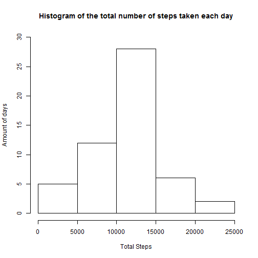
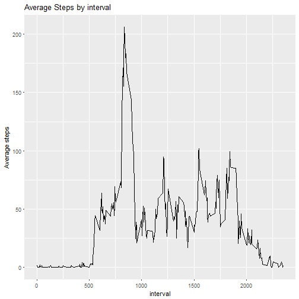
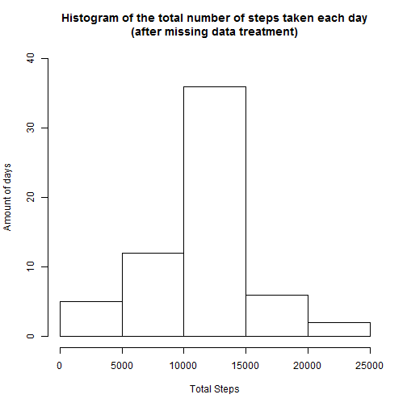
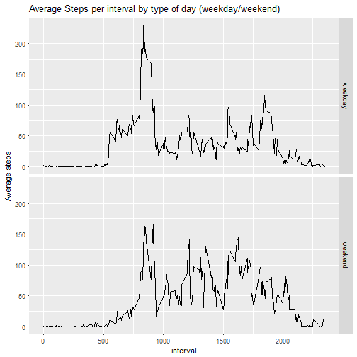

```r
---
title: 'Reproducible Research: Week 2 peer-Assignment'
author: "YW"
output: html_document
---
##Loading and preprocessing the data
```

```r
#Reading csv file
rawcsv<-read.csv("activity.csv")
csv<-na.omit(rawcsv)
# Importing tools for analysis
library(plyr)
library(ggplot2)
```
##What is mean total number of steps taken per day?

```r
# Histogram of the total number of steps taken each day
stepsPerDay<-aggregate(csv$steps, by=list(Category=csv$date), FUN=sum)
colnames(stepsPerDay)<-c("Date","Total.Steps")
hist(stepsPerDay$Total.Steps, ylim = c(0,30),main="Histogram of the total number of steps taken each day", xlab = "Total Steps", ylab = "Amount of days")
```



##Mean and Median calculation

```r
meanTotalSteps<-format(mean(stepsPerDay$Total.Steps),digits=8)
medianTotalSteps<-format(median(stepsPerDay$Total.Steps),digits=8)
```

**The average and median of the total number of steps taken per day is 10766.189 and 10765 respectively.**

##Time series plot of the average number of steps taken

```r
#calculate average steps for each interval
meanStepsByInterval<-ddply(csv,"interval",summarize,Mean_Steps=round(mean(steps,na.rm = TRUE),1), Median_Steps=median(steps[steps>0]))
#preparing the graph of interval averages
g<-ggplot(meanStepsByInterval,aes(interval,Mean_Steps))
g+geom_line()+labs(y = "Average steps", title = "Average Steps by interval")
```



```r
# The 5-minute interval that, on average, contains the maximum number of steps
maxInterval <- meanStepsByInterval$interval[which.max(meanStepsByInterval$Mean_Steps)]
```
**The interval with the Maximum number of average steps is 835**

##Imputing missing values

```r
# Code to describe and show a strategy for imputing missing data
cases<-count(complete.cases(rawcsv))
naCases<-cases[cases$x==FALSE,"freq"]
# Filling missing data - Interval average of all days as replacement
for (i in 1:nrow(rawcsv)){
  if (is.na(rawcsv$steps[i])){
    relatedInterval <- which(rawcsv$interval[i] == meanStepsByInterval$interval)
    rawcsv$steps[i] <- meanStepsByInterval[relatedInterval,]$Mean_Steps
  }
}
```

**Number of NA cases (rows) in the original Date-Base is: 2304**

The strategy applied on missing data: implementing suitable interval average.

Histogram of the total number of steps taken each day (after missing value treatment):

```r
# Histogram of the total number of steps taken each day (after missing value treatment)
stepsPerDay2<-aggregate(rawcsv$steps, by=list(Category=rawcsv$date), FUN=sum)
colnames(stepsPerDay2)<-c("Date","Total.Steps")
histo<-hist(stepsPerDay2$Total.Steps, ylim = c(0,40),main="Histogram of the total number of steps taken each day\n(after missing data treatment)",
     xlab = "Total Steps", ylab = "Amount of days")
```



```r
meanTotalSteps2<-format(mean(stepsPerDay2$Total.Steps),digits=8)
medianTotalSteps2<-format(median(stepsPerDay2$Total.Steps),digits=8)
```

**The average and median of the total number of steps taken per day is 10766.19 and 10766.2 respectively.**

As a result of the missing-data treatment - Median seems to be equal to the Average.   
Conclusion - Imputing missing data affects the Median more than the Average.

##Are there differences in activity patterns between weekdays and weekends?

```r
#Panel plot comparing the average number of steps taken per 5-minute interval across weekdays and weekends
#Setting United-States locale for english day output
Sys.setlocale(category = "LC_ALL", locale = "English_United States.1252")
```

```
## [1] "LC_COLLATE=English_United States.1252;LC_CTYPE=English_United States.1252;LC_MONETARY=English_United States.1252;LC_NUMERIC=C;LC_TIME=English_United States.1252"
```

```r
#Appending weekday and weekend to the rawcsv data
rawcsv$weekDay<-weekdays(as.Date(rawcsv$date))
rawcsv$dayType<-"weekday"
rawcsv$dayType[rawcsv$weekDay %in% c("Saturday", "Sunday")]<-"weekend"
#Average steps per interval by type of day (weekday/weekend)
dayaverage <- aggregate(steps ~ dayType+interval, rawcsv, mean)
colnames(dayaverage)[3]<-"AvgSteps"
#plot
h<-ggplot(dayaverage,aes(interval,AvgSteps))
h+geom_line()+facet_grid(dayType~.)+labs(y = "Average steps", title = "Average Steps per interval by type of day (weekday/weekend)")
```



**According to the graph it seems that:**  
1. People start walking earlier during weekdays.  
2. People seem to disperse their walking phase during weeekends and concentrate it during weekdays (scattered pattern in weekend) 
```

